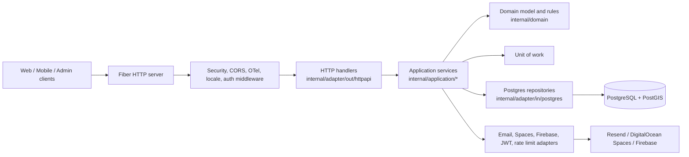
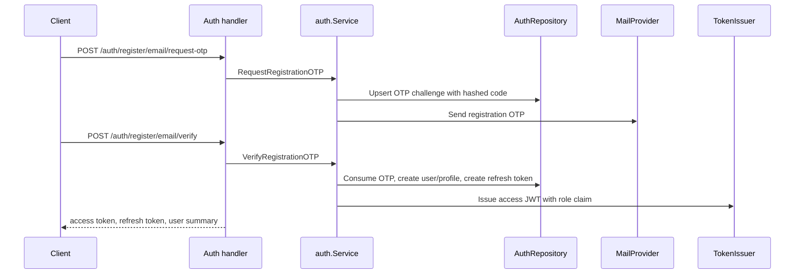
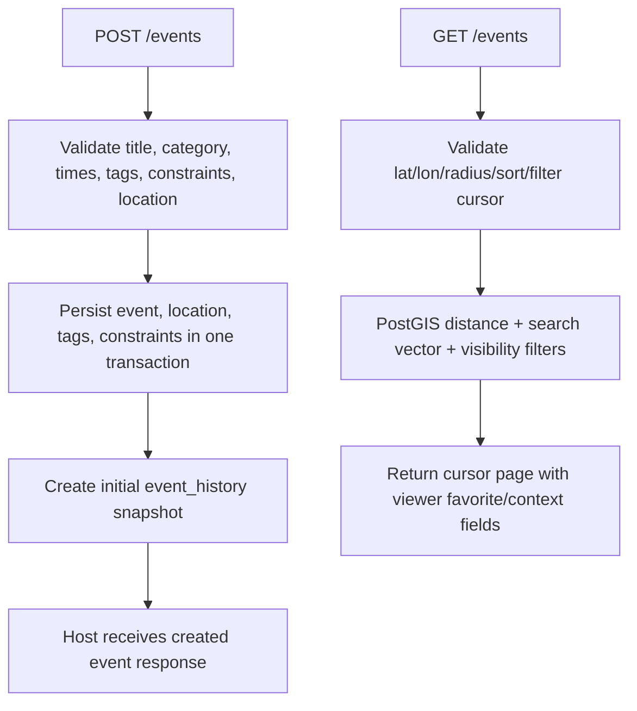
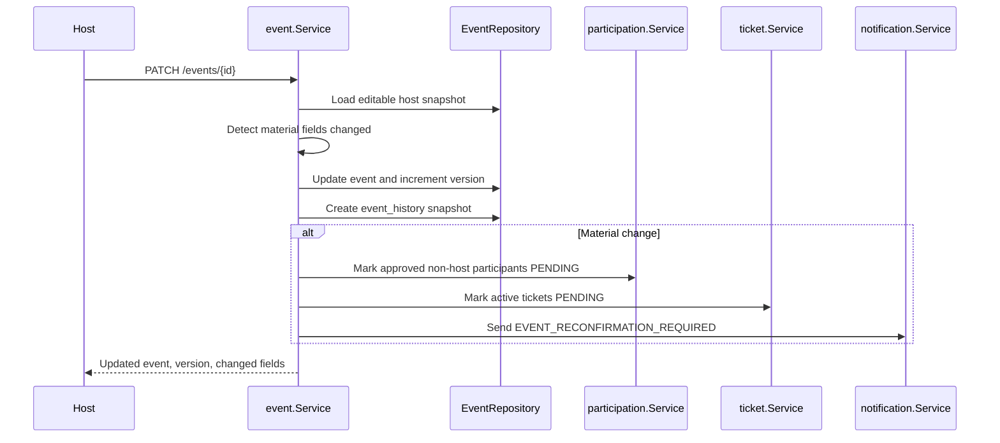
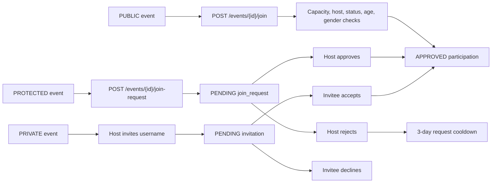
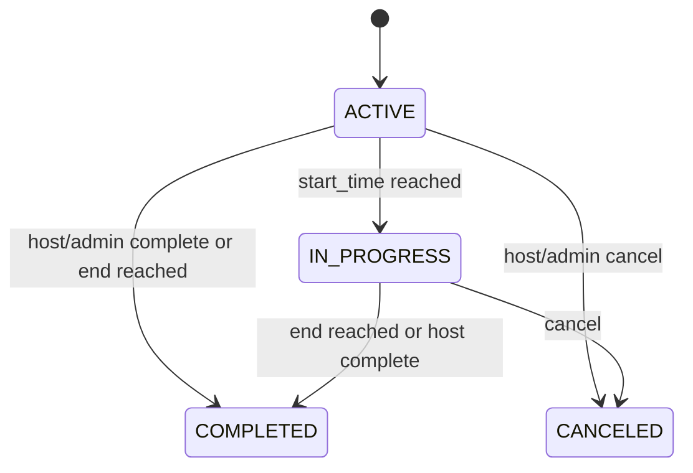
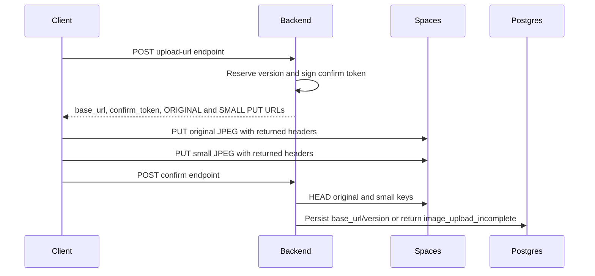
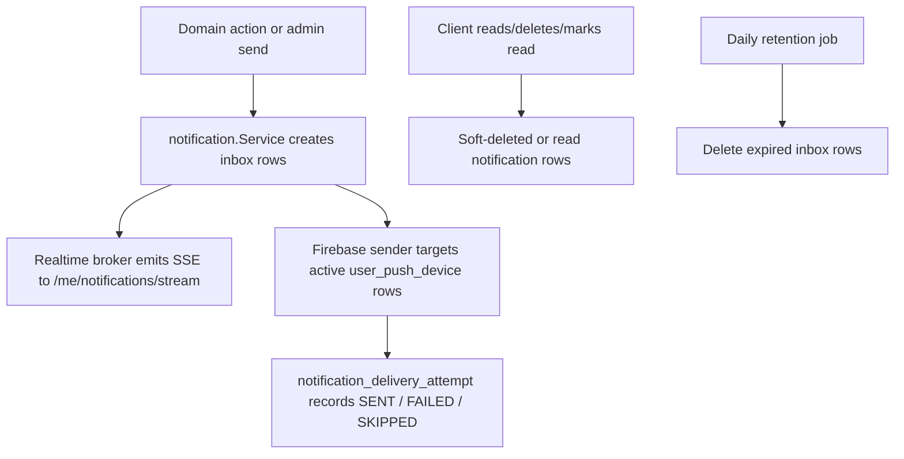

# Backend Architecture

The backend is a Go/Fiber service organized around clean architecture boundaries. HTTP handlers translate transport concerns into application DTOs, application services own use-case orchestration, domain types hold shared business vocabulary, and Postgres/storage/push/email adapters implement driven ports.

## Runtime Composition

`backend/internal/bootstrap/container.go` is the composition root. It loads config, opens the pgx pool, loads i18n catalogs, builds adapters, wires repositories, and constructs services. `backend/internal/server/http.go` mounts the route groups and global middleware.

## Layers

| Layer | Location | Responsibility |
| --- | --- | --- |
| Entrypoint | `cmd/server/main.go` | Configure observability, create the container, start background jobs, listen for HTTP. |
| HTTP delivery | `internal/adapter/out/httpapi/*` | Parse path/query/body input, apply auth claims, call use cases, serialize envelopes, write localized errors. |
| Application | `internal/application/*` | Enforce use-case rules, coordinate repositories, transactions, notifications, tickets, badges, and image confirmation. |
| Domain | `internal/domain/*` | Typed statuses/enums, entities, shared validation helpers, domain error codes. |
| Driven adapters | `internal/adapter/in/*` | Postgres repositories, JWT issuance/verification, bcrypt, OTP, in-memory rate limits, email, Spaces, Firebase push. |
| Infrastructure | `internal/infrastructure/*` | Config loading, pgx pool, OpenTelemetry/New Relic setup. |

## Service Map

| Service | Main collaborators | Notes |
| --- | --- | --- |
| `auth.Service` | auth repo, refresh token manager, OTP generator, email mailer, rate limiters, token issuer | Registration, login, refresh rotation, logout, password reset, availability checks. |
| `event.Service` | event repo, participation, join request, ticket, notification, badge services | Event create/update/discovery/detail, lifecycle transitions, joining, favorites, host moderation. |
| `participation.Service` | participation repo, badge service | Participation status changes and reconfirmation after event edits. |
| `invitation.Service` | invitation repo, unit of work, ticket, notification | Private-event invitations and invitation responses. |
| `join_request.Service` | join request repo, unit of work, ticket, notification | Protected-event approval/rejection/cancellation. |
| `ticket.Service` | ticket repo, unit of work, JWT ticket token manager | Protected-event ticket lifecycle, QR token streaming, host scans. |
| `notification.Service` | notification repo, push sender, realtime broker, translator | In-app inbox, SSE stream, push device registration, push fanout, retention. |
| `imageupload.Service` | profile/event repos, Spaces storage, image upload JWT manager | Presigned upload URL creation and object-existence confirmation. |
| `profile.Service` | profile repo, unit of work, bcrypt | Profile, equipment, showcase images, password changes, profile event collections. |
| `rating.Service` | rating repo, unit of work, badge service | Event and participant ratings, Bayesian host score refresh. |
| `comment.Service` | comment repo, unit of work, rating service, image upload confirmer | Discussion comments, replies, completed-event review comments. |
| `eventreport.Service` | event report repo, image upload confirmer | Event abuse/report submission. |
| `badge.Service` | badge repo | Badge catalog, earned badges, backfill, and rule evaluation. |
| `admin.Service` | admin repo, notification, ticket, unit of work | ADMIN-only operational lists and controlled mutations. |

## HTTP Surface

Most APIs are mounted under `/api` by deployment/proxy convention, while the Fiber app registers paths without that prefix. Authentication uses bearer JWTs.

| Area | Routes | Auth |
| --- | --- | --- |
| Health | `GET /health` | Public |
| Auth | `/auth/*` | Public |
| Categories | `GET /categories` | Public |
| Events | `/events`, `/events/{id}`, join/favorite/comment/rating/report/image subroutes | Optional or required per operation |
| Profile | `/me`, `/me/equipment`, `/me/events/*`, `/me/invitations/*`, `/users/{id}/profile`, `/users/search` | Required |
| Favorite locations | `/me/favorite-locations/*` | Required |
| Notifications | `/me/notifications/*`, `/me/push-devices/*` | Required |
| Tickets | `/me/tickets/*`, `/host/events/{eventId}/ticket-scans` | Required |
| Badges | `/me/badges`, `/users/{id}/badges`, `/badges` | Required |
| Admin | `/admin/*` | ADMIN role |

## Cross-Cutting Behavior

- Security middleware applies recovery, CORS, `nosniff`, frame denial, referrer policy, permissions policy, and a restrictive API content security policy.
- OpenTelemetry Fiber middleware emits request metrics/traces. Application logs are structured at meaningful business boundaries.
- Locale resolution runs before routes. Authenticated requests can fall back to the user locale in `app_user.locale`.
- Error responses use a consistent `{"error": {"code", "message", "details?"}}` envelope.
- `UnitOfWork` wraps multi-repository mutations in Postgres transactions.
- Background jobs run from `cmd/server/main.go`: event lifecycle transitions every minute, badge backfill at startup, and notification retention daily.

## Core Flows

### Registration and Session

Refresh tokens are opaque values stored as hashes. Refresh rotates the token and links the replacement inside one token family so reuse can revoke the family.

### Event Creation and Discovery

Discovery only returns `ACTIVE` `PUBLIC` and `PROTECTED` events. Anonymous users do not see audience-restricted events; authenticated users are filtered by the age/gender profile data that exists on their account.

### Event Update and Reconfirmation

Material changes are title, description, category, location/address/geometry/route, start/end time, and added constraints. Removing constraints alone does not require reconfirmation.

### Participation, Invitations, and Join Requests

`participation` is the source of current membership. `join_request` and `invitation` capture protected/private access workflows. Capacity counts are synchronized by database triggers and exclude the host's default participation.

### Event Lifecycle, Tickets, and Badges

Protected/private approvals create tickets for active participation. Ticket QR tokens are short-lived JWT-like tokens; hosts scan via `/host/events/{eventId}/ticket-scans`. Lifecycle operations cancel, expire, activate, or pend tickets alongside event and participation status changes. Badge evaluation runs after participation, hosting, favorite-location, and rating-relevant events; startup backfill recomputes historical eligibility.

### Direct Image Upload

Image bytes never pass through the backend. The database stores the versioned `base_url`; clients derive the small variant with `base_url + "-small"`.

### Notifications

Notification creation is best-effort relative to most domain actions: failures are logged but generally do not roll back the original business action unless the admin notification operation itself is the requested action.

## API Documentation Contract

OpenAPI source files live in [`docs/openapi/`](../openapi/). When backend route behavior changes, update the matching YAML and regenerate the Postman collection with [`docs/postman/generate.sh`](../postman/generate.sh).
