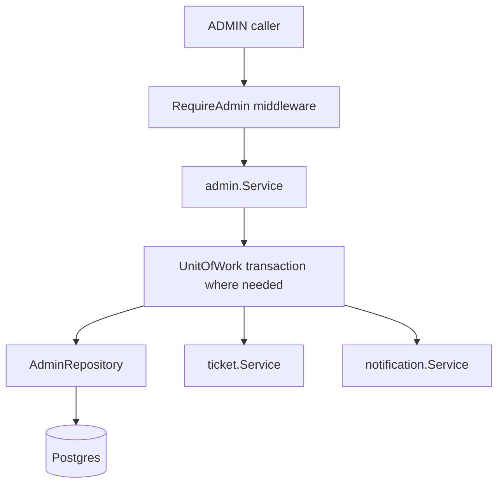

# Admin Panel Backend

The admin panel is a web-only backoffice surface for users with the `ADMIN` role. Mobile must not expose an entry point to it.

## Backend Shape

Admin APIs are mounted under `/admin` and protected by `httpapi.RequireAdmin`, which verifies the bearer JWT and requires the role claim to be `ADMIN`. Regular authenticated users receive `403 admin_access_required`.

The admin service is intentionally separate from user-facing services. It can inspect operational data and run controlled mutations without accidentally reusing normal user flows in ambiguous ways.

## Route Groups

| Area | Endpoints |
| --- | --- |
| Users | `GET /admin/users`, `POST /admin/users/{user_id}/deactivate` |
| Events | `GET /admin/events`, `PATCH /admin/events/{event_id}/status`, `POST /admin/events/{event_id}/cancel` |
| Reports | `GET /admin/event-reports`, `PATCH /admin/event-reports/{report_id}/status` |
| Categories | `GET /admin/categories`, `POST /admin/categories`, `DELETE /admin/categories/{category_id}` |
| Participations | `GET /admin/participations`, `POST /admin/participations`, `POST /admin/participations/{participation_id}/cancel` |
| Tickets | `GET /admin/tickets` |
| Notifications | `GET /admin/notifications`, `POST /admin/notifications` |
| Invitations and requests | `GET /admin/invitations`, `PATCH /admin/invitations/{invitation_id}/status`, `GET /admin/join-requests`, `PATCH /admin/join-requests/{join_request_id}/status` |
| Social/moderation | `GET /admin/comments`, `DELETE /admin/comments/{comment_id}`, ratings/favorites/badges/push-device list and delete/revoke endpoints |

## Controlled Mutations

### Deactivate user

Deactivation sets `app_user.status = 'deactivated'`, revokes refresh tokens and push devices, cancels hosted cancelable events, cancels the user's active participation/tickets, and cancels pending invitations and join requests for the user. The operation is transactional for database state.

### Manual participation

Manual creation validates that the event and user exist, prevents impossible statuses, respects event capacity for approved participants, creates or reactivates the participation row, and creates a ticket when the resulting participation needs one. Manual cancellation marks participation canceled and cancels the active/pending ticket for the participation.

### Event cancellation

Admin cancellation transitions the event to `CANCELED`, snapshots the approved participant count, cancels participations, pending invitations, pending join requests, and event tickets.

### Custom notifications

Admin notification send accepts target user IDs, delivery mode (`IN_APP`, `PUSH`, or `BOTH`), title/body, optional type/deep link/image/data, and delegates to notification service fanout. Invalid target users are rejected before send.

## Documentation

The admin contract is documented in [`docs/openapi/admin.yaml`](../../openapi/admin.yaml). Regenerate the Postman collection after admin API changes.
