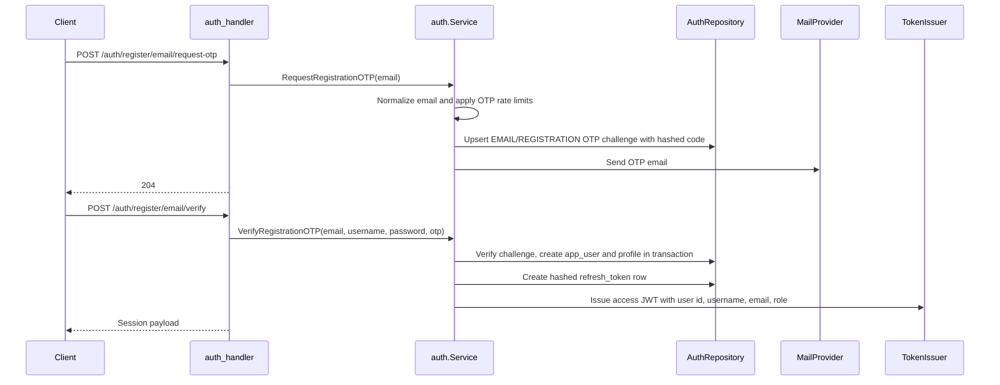
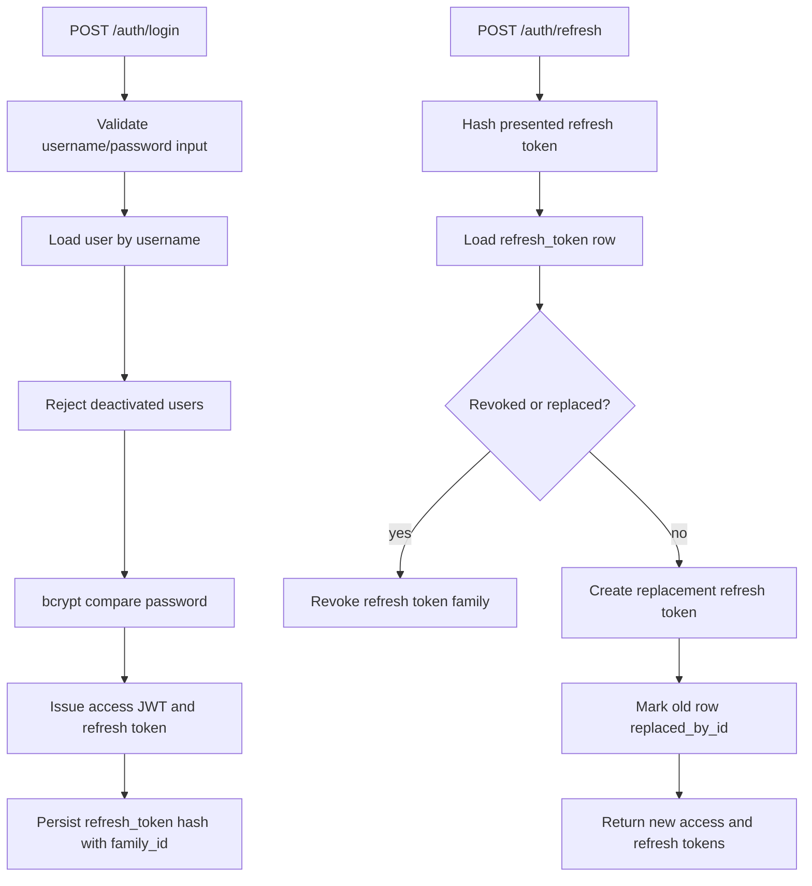
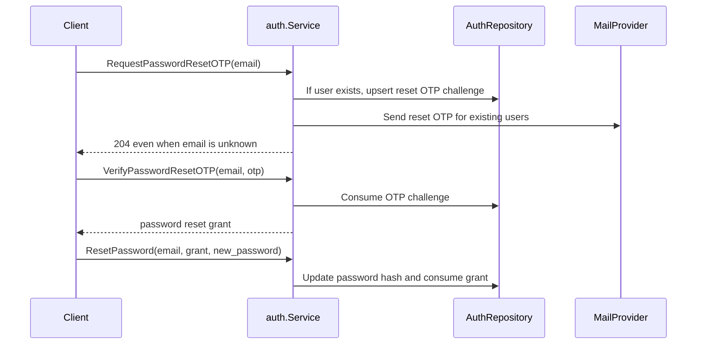

# Auth and Sessions

Auth is implemented by `auth.Service` with the auth repository, OTP generator, email mailer, refresh-token manager, password hasher, token issuer, and rate limiters wired in `bootstrap.Container`.

## Registration

Business rules:

- Registration starts with a challenge, not immediate user creation.
- OTP codes are stored as hashes, and challenges track attempts, expiry, and consumption.
- New users get default role `USER`, status `active`, and locale `en` unless changed later.
- The auth response includes a user summary and a bearer access token; the refresh token is opaque and stored only as a hash.

## Login and Refresh

Refresh rotation is the main session-safety mechanism. If a rotated token is reused, the whole family is revoked.

## Logout

`POST /auth/logout` revokes the supplied refresh token. Access tokens are stateless JWTs and remain valid until their short TTL expires.

## Password Reset

Unknown reset emails are handled silently so the API does not disclose registered accounts.

## Authorization Claims

Access-token claims are attached by middleware:

- `RequireAuth` rejects missing/invalid tokens.
- `OptionalAuth` enriches a request when a token is present and valid.
- `RequireAdmin` requires the `ADMIN` role claim.

The role is persisted on `app_user.role` and serialized as uppercase `USER` or `ADMIN`.
