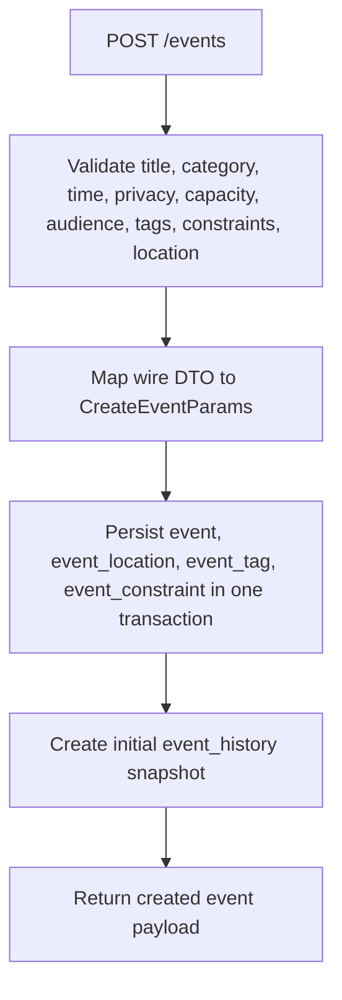
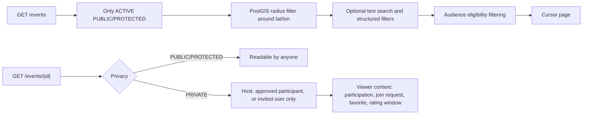
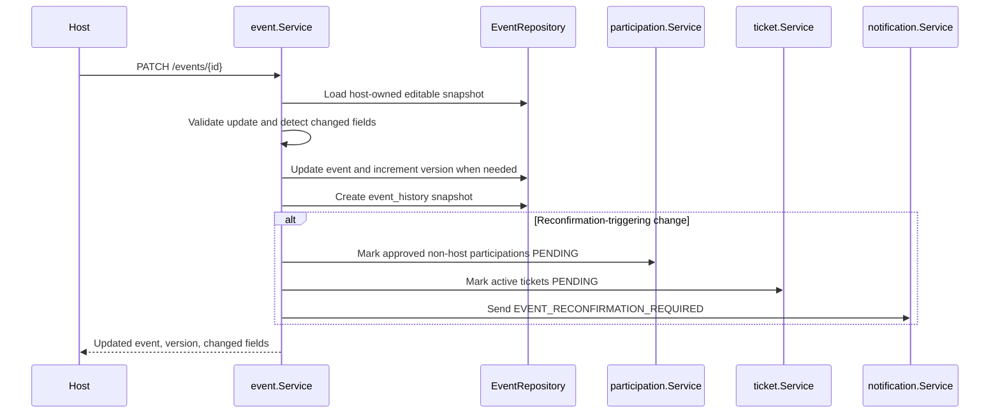
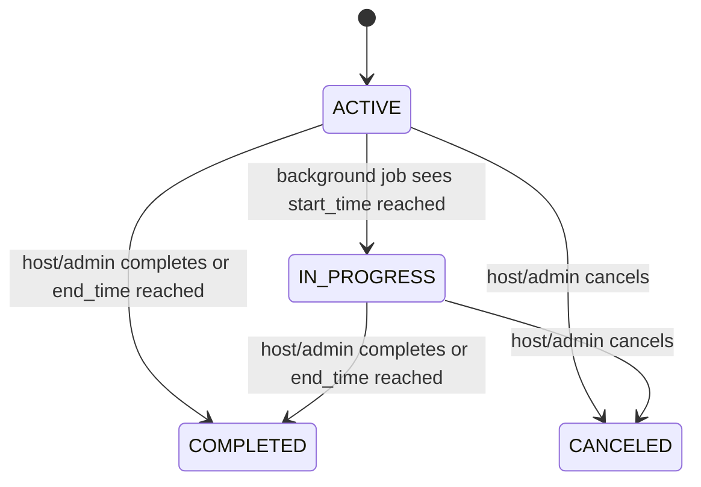

# Event Management

Event behavior is centered in `event.Service`. It coordinates event persistence, participation state, join requests, tickets, notifications, badges, and event-history snapshots.

## Create Event

Important rules:

- The authenticated caller becomes `host_id`.
- A host cannot reuse the same trimmed title for another event.
- `category_id` must reference `event_category`.
- `start_time` must be in the future on create.
- `POINT` events store one point; `ROUTE` events store route geometry with at least two points.
- Tags and constraints are bounded by domain limits.

## Discovery and Detail Visibility

Discovery deliberately excludes `PRIVATE` events. Detail hides unreadable private events with `404 event_not_found` to avoid leaking their existence.

## Update and Reconfirmation

Reconfirmation-triggering changes include title, description, category, location/address/geometry/route, start/end time, and newly added constraints. Removing constraints alone does not require reconfirmation.

Participants call `POST /events/{id}/participation/reconfirm` to move from `PENDING` back to `APPROVED` for the current `event.version_no`. Pending tickets are activated with the participation.

## Cancellation and Completion

Cancellation cascades operational state:

- event status becomes `CANCELED`
- approved participant count is snapshotted
- participations are canceled
- pending invitations and join requests are canceled
- active/pending tickets are canceled
- affected users receive event notifications when notification service is available

Completion allows ratings and review comments according to their event-specific mutation windows.

## Background Status Transition Job

`Container.StartEventExpiryJob` runs every minute. It advances event statuses, expires/activates related tickets as needed, and evaluates participation badges for newly completed events.
