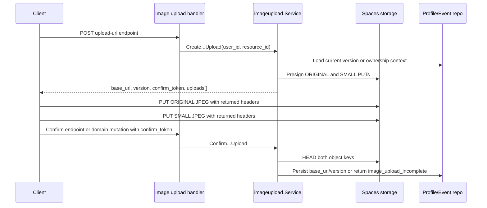

# Image Upload Flow

The backend supports direct uploads to DigitalOcean Spaces for profile avatars, profile showcase images, event cover images, review images, join-request images, and event-report images.

## Overview

The upload flow is:

1. Client requests presigned upload instructions from the backend.
2. Backend reserves the target object key/version and returns:
   - a CDN `base_url`
   - an opaque `confirm_token`
   - two direct-upload instructions: `ORIGINAL` and `SMALL`
3. Client uploads both JPEG files directly to DigitalOcean Spaces with the returned method, URL, and headers.
4. Client sends the `confirm_token` to the appropriate confirm operation or embeds it in the owning domain mutation.
5. Backend verifies both objects exist and persists the final URL.

This keeps image bytes out of the backend and uses versioned keys so CDN caches can keep old URLs safely.

## Supported Resources

| Resource | Upload init | Confirmation |
| --- | --- | --- |
| Profile avatar | `POST /me/avatar/upload-url` | `POST /me/avatar/confirm` |
| Profile showcase image | `POST /me/showcase-images/upload-url` | `POST /me/showcase-images/confirm` |
| Event cover image | `POST /events/{id}/image/upload-url` | `POST /events/{id}/image/confirm` |
| Event review image | `POST /events/{id}/review-comments/image/upload-url` | Confirmed by `POST /events/{id}/review-comments` with the returned token. |
| Join-request image | `POST /events/{id}/join-request/image/upload-url` | Confirmed by `POST /events/{id}/join-request` with the returned token. |
| Event-report image | `POST /events/{id}/reports/image/upload-url` | Confirmed by `POST /events/{id}/reports` with the returned token. |

## Sequence

## Required Upload Headers

Clients must send every returned upload header exactly as returned. Current headers are:

- `Content-Type: image/jpeg`
- `Cache-Control: public, max-age=604800, immutable`
- `x-amz-acl: public-read`

Browser CORS on the Space must allow `GET`, `HEAD`, `PUT` and the headers above.

## Stored URL Rule

The backend stores only `base_url`.

- Original: `base_url`
- Small: `base_url + "-small"`

Old files are not deleted during updates. Each confirmed update writes a new versioned URL.

## Common Errors

| Code | Meaning |
| --- | --- |
| `invalid_token` | Access token or confirm token is invalid or expired. |
| `image_upload_incomplete` | One or both uploaded objects were missing during confirm. Upload both variants with the returned headers and retry confirmation if the token is still valid. |
| `event_not_found` / `forbidden` | The caller cannot upload for the target event or the event does not exist. |
