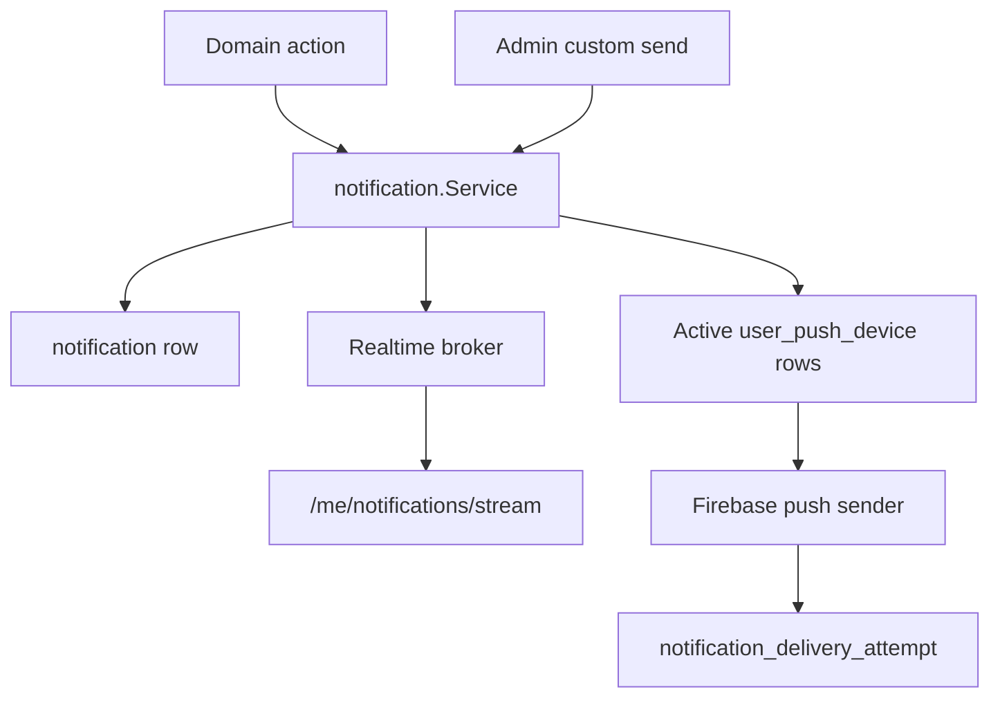
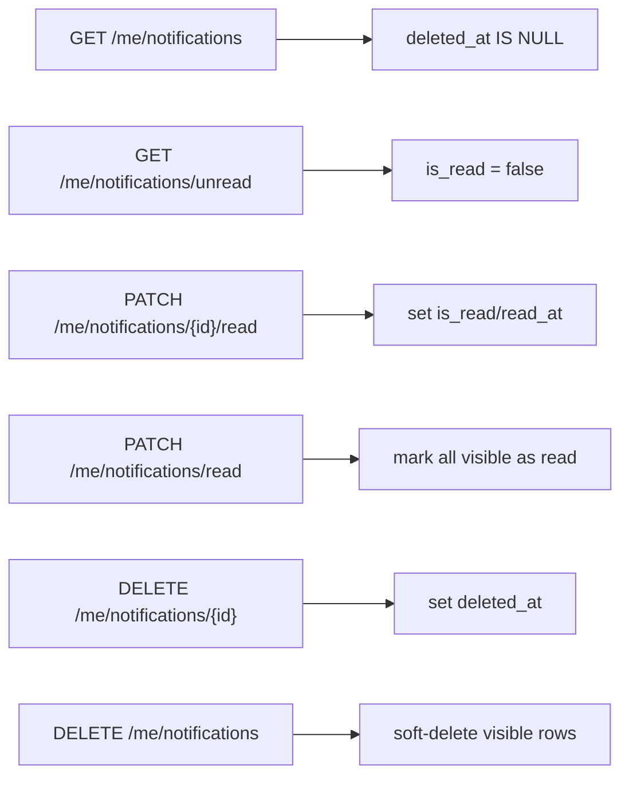
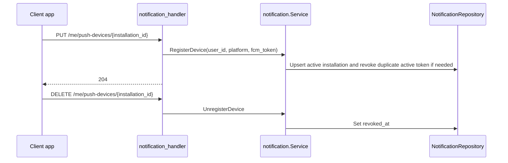
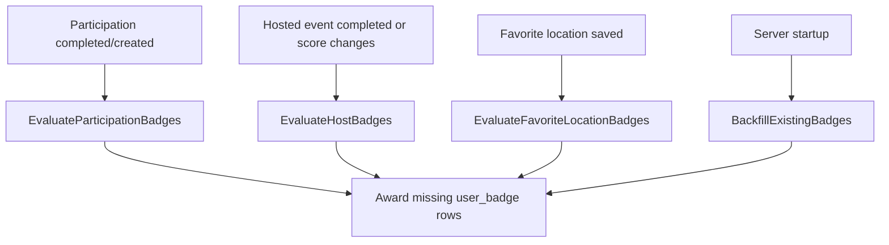

# Notifications and Badges

Notifications and badges are cross-cutting services. Domain flows call them after primary mutations so clients receive updates and users earn progress markers.

## Notification Fanout

Common notification sources:

- invitation created, accepted, declined, or revoked
- protected join request created, approved, rejected, or canceled
- event update requires reconfirmation
- event canceled or completed
- admin custom notification

Notification delivery usually should not roll back the original business mutation. The exception is when notification sending is itself the requested admin operation.

## In-App Inbox

`notification.deleted_at` gives clients deletion semantics without requiring immediate hard deletes. A retention job later removes expired rows.

## Push Devices

Auth logout and admin deactivation can revoke push devices so stale sessions stop receiving push notifications.

## Badge Evaluation

Badge writes are idempotent because `user_badge` has a `(user_id, badge_id)` primary key. The catalog is seeded by migration and exposed through badge endpoints.

## Retention and Localization

- `StartNotificationRetentionJob` runs daily and deletes expired notification rows.
- Notification text is rendered using the recipient locale at creation time.
- Error responses use request locale resolution; notification rows do not retranslate when a user later changes locale.
