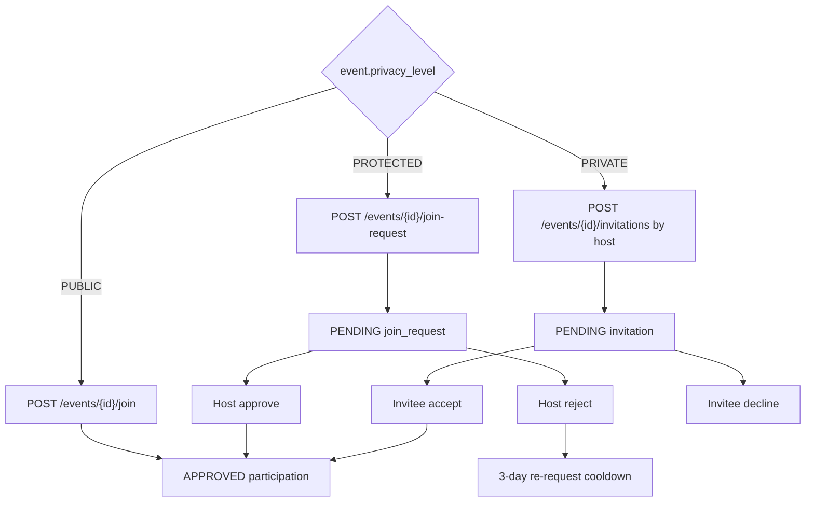
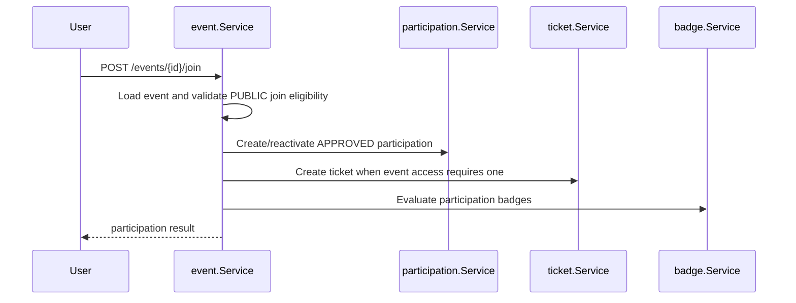
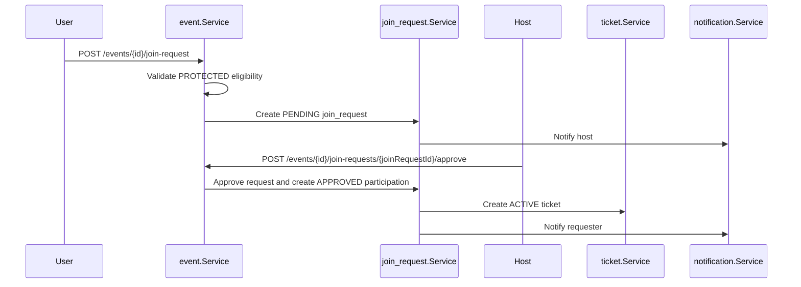

# Participation Access

Participation access spans public joins, protected join requests, private invitations, event capacity, profile eligibility, tickets, and notifications.

## Access Model

`participation` is the current membership table. `join_request` and `invitation` represent access workflows that may eventually create or reactivate participation rows.

## Shared Eligibility Checks

Before a user can join or request access, the backend checks:

- caller is not the event host
- event is joinable and not canceled/completed
- privacy mode matches the operation
- event capacity is not exceeded for approval/direct joins
- duplicate active participation is not present
- audience restrictions are satisfied
- profile has required fields for restricted events

Audience checks live in `domain.CheckParticipationEligibility`, so public joins and protected join requests use the same age/gender logic.

## Public Join

The database trigger `sync_participation_counts` updates approved/pending counts after participation changes.

## Protected Join Request

Rejected requests enter a cooldown window. The requester can cancel their own pending request through `DELETE /events/{id}/join-requests/me`.

## Private Invitations

Private events are not discoverable. The host invites users by exact username through `POST /events/{id}/invitations`.

Business behavior:

- invitation creation is partial-success by username
- accepted invitations create or reactivate approved participation
- declined invitations start a cooldown for repeated invitation attempts
- host can revoke a pending invitation with `DELETE /events/{id}/invitations/{invitationId}`
- invitees can inspect pending invitation state under `/me/invitations`

## Leave and Cancellation

`PATCH /events/{id}/leave` marks the caller's participation as `LEAVED` and cancels the linked active/pending ticket. Event/admin cancellation uses `CANCELED` and cancels broader event state. The `LEAVED` spelling is the existing persisted enum value.
