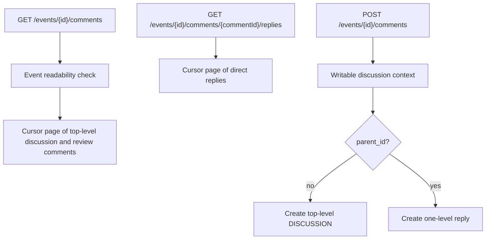
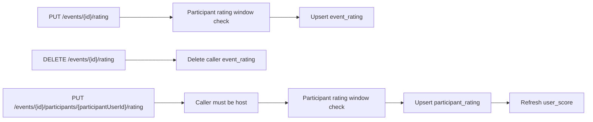
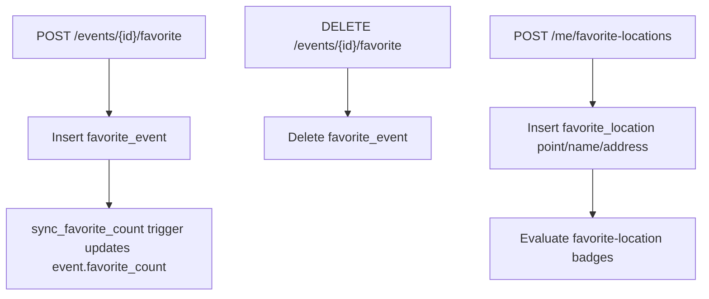
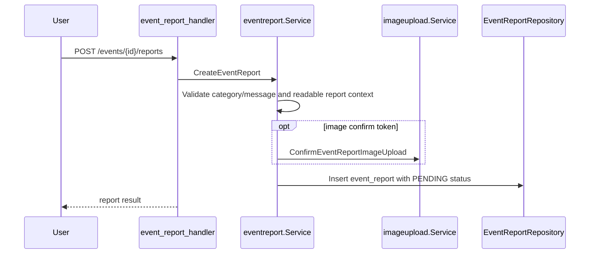

# Social Feedback

Social feedback covers event discussion, completed-event review comments, event ratings, participant ratings, favorite events/locations, and event reports.

## Discussion Comments

Database triggers enforce that replies belong to the same event, target a discussion comment, and do not create nested replies. `event_comment.reply_count` and `likes_count` are trigger-maintained counters.

## Review Comments

`POST /events/{id}/review-comments` creates or updates the caller's completed-event review comment. Review comments:

- require the event to be completed
- require the caller to be an approved participant
- are one per `(event_id, user_id)`
- can include a confirmed review image upload token
- carry a rating from 1 to 5

When a review changes, `comment.Service` refreshes the host's rating summary through the rating service.

## Ratings

Event ratings are submitted by participants for completed events. Participant ratings are submitted by hosts for participants. Both use bounded rating/message validation and time-window checks.

## Favorites

Favorite events are event-scoped. Favorite locations are user-owned saved places backed by PostGIS points.

## Event Reports

Admins moderate reports through `/admin/event-reports` and can move statuses among `PENDING`, `REVIEWED`, and `DISMISSED`.
