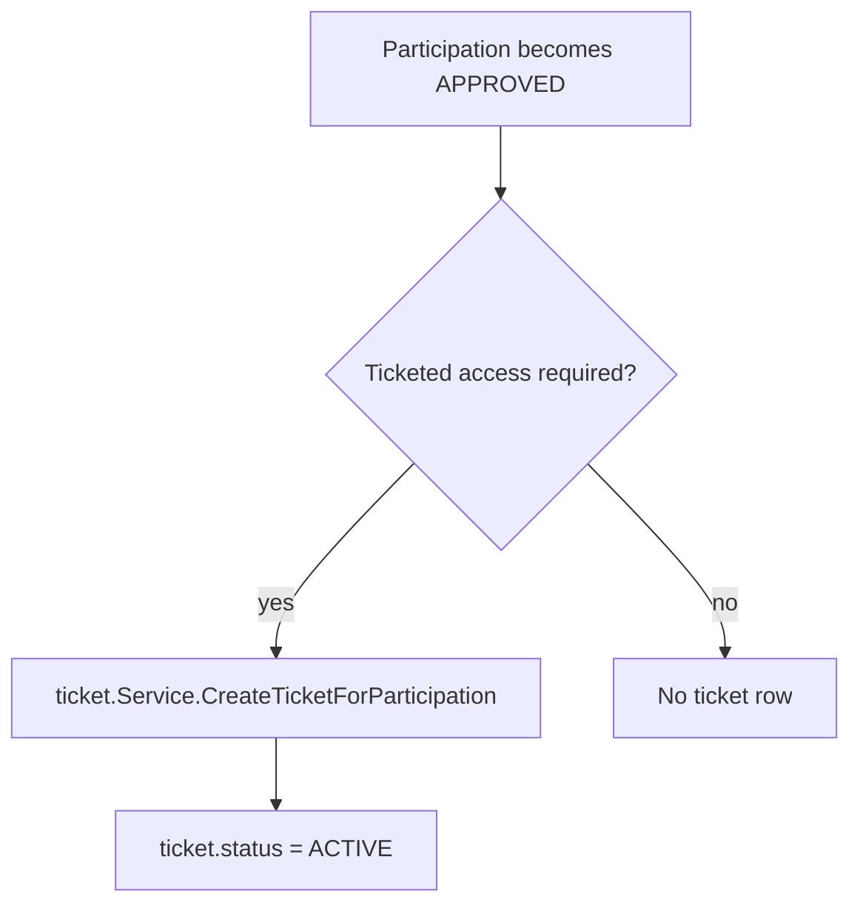
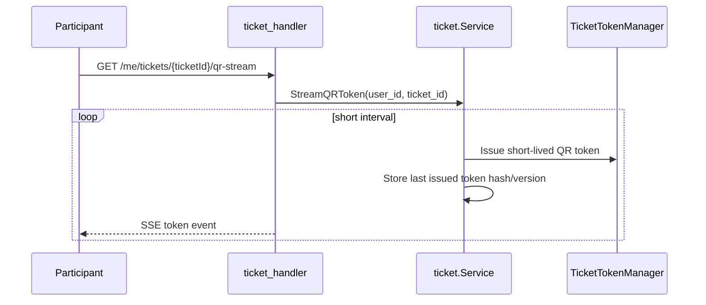
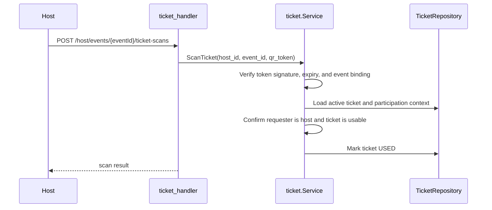
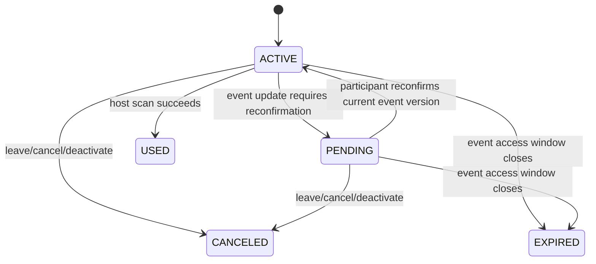

# Tickets and Check-In

Tickets model event entry for protected/private access flows and are managed by `ticket.Service`.

## Ticket Creation

Tickets are linked to `participation.id`. The database permits at most one non-terminal ticket (`ACTIVE` or `PENDING`) per participation.

## QR Token Stream

The QR token TTL is intentionally short. The backend stores token hashes, not reusable plaintext token values.

## Host Scan

Scan rejects wrong-event tokens, expired tokens, non-host callers, terminal tickets, and already-used tickets.

## Ticket Lifecycle Coupling

Event and participation flows call ticket lifecycle methods so ticket state stays aligned with membership state.

## Client Surfaces

- Participants list their tickets with `GET /me/tickets`.
- Participants inspect one ticket with `GET /me/tickets/{ticketId}`.
- Participants stream short-lived QR tokens with `GET /me/tickets/{ticketId}/qr-stream`.
- Hosts scan with `POST /host/events/{eventId}/ticket-scans`.
