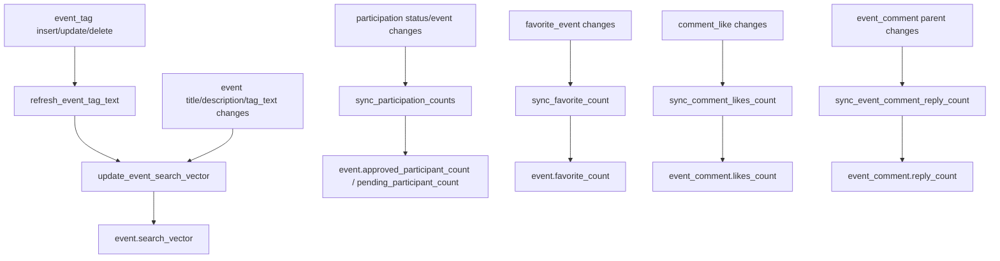

# Backend Database

PostgreSQL with PostGIS is the backend persistence layer. Runtime schema changes are applied from [`backend/migrations/`](../../backend/migrations/) by `golang-migrate`; [`docs/db/schema.sql`](schema.sql) is a reference snapshot for readers and reviewers.

## Alignment Check

Checked against migrations through `000034_profile_public_assets` on 2026-05-11.

The reference schema had drift in these areas and was updated or annotated as part of this documentation pass:

- `app_user` needed current `role`, `locale`, non-null/default `status`, and admin/status indexes.
- `event.version_no` needed the migrated default/positive constraint.
- `event_history` needed snapshot/version metadata columns and the version-desc index.
- `event_constraint`, `participation`, `join_request`, `invitation`, and event-report admin indexes needed to be represented.
- `ticket` needed the lifecycle migration shape: no long-lived `qr_token`, version/hash fields, terminal timestamps, status constraint, and active/pending uniqueness.
- `event_comment` needed discussion/review columns, review shape constraints, reply-count indexes, and parent/reply-count triggers.
- `event_report`, `badge`, and `user_badge` were missing from the reference schema.

The migration files remain the authoritative source. If a future migration changes schema, update `docs/db/schema.sql` and this document in the same backend documentation PR.

## Entity Relationship Overview

```mermaid
erDiagram
    app_user ||--|| profile : owns
    app_user ||--o{ refresh_token : has
    app_user ||--o{ otp_challenge : receives
    app_user ||--o{ event : hosts
    app_user ||--o{ participation : joins
    app_user ||--o{ favorite_event : saves
    app_user ||--o{ favorite_location : saves
    app_user ||--o{ invitation : invited
    app_user ||--o{ join_request : requests
    app_user ||--o{ notification : receives
    app_user ||--o{ user_push_device : registers
    app_user ||--o{ user_badge : earns
    app_user ||--o{ profile_equipment : owns
    app_user ||--o{ profile_showcase_image : owns

    event_category ||--o{ event : categorizes
    event ||--o{ event_location : locates
    event ||--o{ event_tag : labels
    event ||--o{ event_constraint : restricts
    event ||--o{ event_history : versions
    event ||--o{ participation : contains
    event ||--o{ favorite_event : favorited
    event ||--o{ invitation : invites
    event ||--o{ join_request : receives
    event ||--o{ event_comment : comments
    event ||--o{ event_rating : rated
    event ||--o{ participant_rating : participant_rated
    event ||--o{ event_report : reported

    participation ||--o{ ticket : issues
    participation ||--o{ feedback : legacy_feedback
    notification ||--o{ notification_delivery_attempt : attempts
    user_push_device ||--o{ notification_delivery_attempt : push_attempts
    badge ||--o{ user_badge : awarded
```

## Table Groups

| Group | Tables | Purpose |
| --- | --- | --- |
| Identity | `app_user`, `profile`, `refresh_token`, `otp_challenge` | Accounts, public profile, token rotation, and email OTP challenges. |
| Profile assets | `profile_equipment`, `profile_showcase_image` | Public profile equipment and showcase images. |
| Events | `event`, `event_category`, `event_location`, `event_tag`, `event_constraint`, `event_history` | Event core data, PostGIS geometry, tags, restrictions, and version snapshots. |
| Participation | `participation`, `invitation`, `join_request`, `ticket` | Public joins, protected requests, private invitations, and protected/private entry tickets. |
| Social | `favorite_event`, `favorite_location`, `event_comment`, `comment_like` | Favorites, saved locations, discussion comments, review comments, and likes. |
| Reputation | `event_rating`, `participant_rating`, `user_score`, `badge`, `user_badge` | Event/host ratings, cached scores, and earned badges. |
| Notifications | `notification`, `user_push_device`, `notification_delivery_attempt` | In-app inbox, push targets, SSE/FCM delivery records. |
| Moderation/admin | `event_report`, `category_suggestion` | Abuse reports and category suggestions. |

## Key Lifecycle Columns

| Column | Notes |
| --- | --- |
| `app_user.status` | `active` or `deactivated`; deactivation revokes refresh tokens and push devices and cancels relevant operational state. |
| `app_user.role` | `USER` or `ADMIN`; JWT access-token claims carry this role for `RequireAdmin`. |
| `app_user.locale` | `en` or `tr`; used as authenticated fallback for localized error and notification text. |
| `event.status` | `ACTIVE`, `IN_PROGRESS`, `CANCELED`, or `COMPLETED`; transitioned by host/admin actions and the expiry job. |
| `event.version_no` | Starts at `1`; increments when event updates create a new `event_history` snapshot. |
| `participation.last_confirmed_event_version` | Used to determine whether an approved/pending participant has reconfirmed the current event version. |
| `ticket.status` | `ACTIVE`, `PENDING`, `EXPIRED`, `USED`, `CANCELED`; at most one non-terminal ticket per participation. |
| `notification.deleted_at` and `read_at` | Support soft deletion and read-state without removing active inbox rows immediately. |

## Trigger-Owned Derivations

These counters should be treated as database-owned derived values. Application services should mutate source rows and let triggers maintain counts.

## Event Versioning

`event_history` stores both legacy column projections and a canonical `snapshot` JSONB payload. The snapshot captures the event fields clients need to compare versions, including category, location, route points, tags, and constraints. When material fields change, `event.version_no` increments and a new `event_history` row records `changed_fields`, `created_by_user_id`, and `event_updated_at`.

Participants compare `participation.last_confirmed_event_version` with the current event version. Reconfirmation moves a pending participation back to approved and activates pending tickets when applicable.

## Spatial Data

- `event_location.geom` is `GEOGRAPHY(GEOMETRY, 4326)` so point and route geometries can share one table.
- `favorite_location.point` and `app_user.default_location_point` are `GEOGRAPHY(POINT, 4326)`.
- GIST indexes support discovery radius queries and saved-location lookups.

## Migration and Reference Workflow

1. Add a numbered migration pair under `backend/migrations/`.
2. Update `docs/db/schema.sql` to reflect the post-migration shape.
3. Update this document if relationships, triggers, lifecycle states, or table ownership changed.
4. If API payloads changed, update [`docs/openapi/`](../openapi/) and regenerate Postman.
